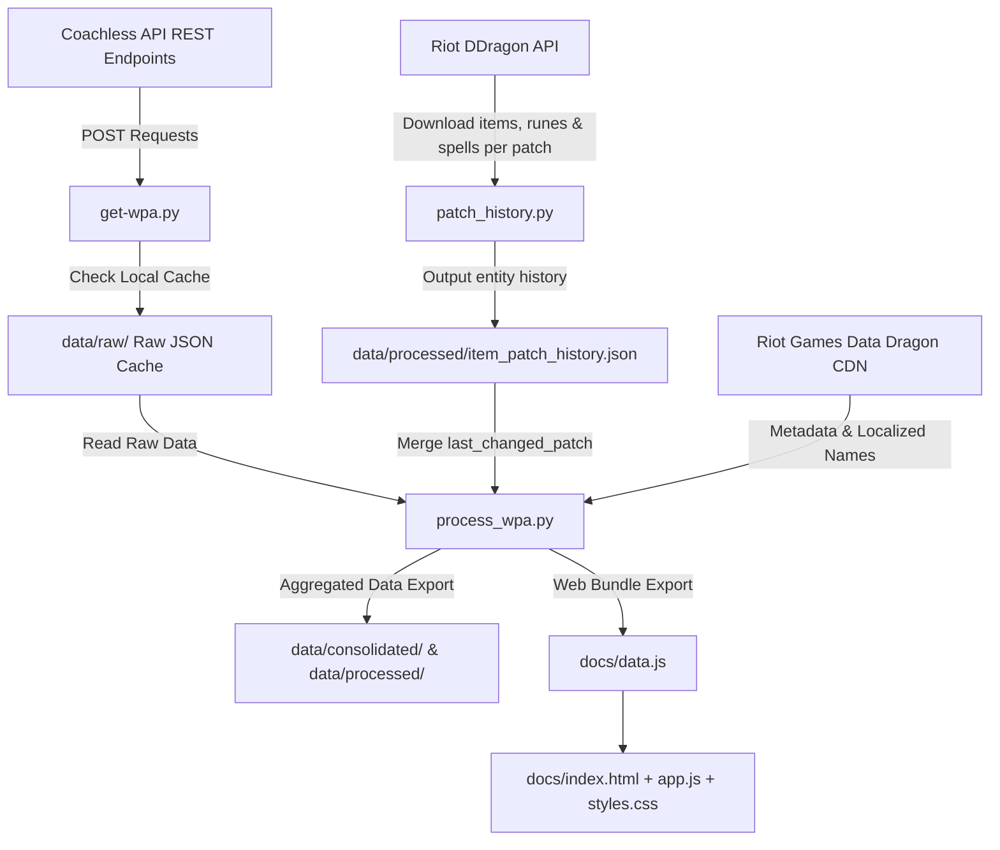

# System Patterns & Architecture

## 4-Phase Architecture



---

## Design Patterns & Mathematical Frameworks

### 1. Data Extraction & Intelligent Caching (`get-wpa.py`)
- Iterates over configured champions (`CHAMPIONS = [236, 901, 245]`) and patch list (`PATCHES = [1..16]`).
- Skips historical patches already present in `data/raw/coachless_champ_{id}_full_stats.json`.
- Forces re-download for the current active/latest patch to maintain up-to-date stats.
- Two-tier exception handling (`safe_fetch`) with backoff delays to manage API rate limits.

### 2. Multi-Entity DDragon Patch Diffing (`patch_history.py`)
- Download & local cache of `item.json`, `runesReforged.json`, and `summoner.json` per patch from DDragon CDN.
- Automated diffing of cost, stats, short/long descriptions, and spell cooldowns across consecutive patches (978 total entities tracked).
- Export to `data/processed/item_patch_history.json`.

### 3. Time-Decay Exponential Weighting ($\lambda = 0.75$)
- Recency-weighted WPA aggregation with half-life $\approx 2.41$ patches:
  $$w_i = \text{sample}(P_i) \times 0.75^{(N - i)}$$
  $$\text{WPA}_{\text{recency}} = \frac{\sum \text{WPA}(P_i) \times w_i}{\sum w_i}$$
- Suppresses multi-month old meta noise while maintaining high statistical confidence for recent play.

### 4. Smart Composite Ranking (`smart_rank`) & Role Badging
- Composite score algorithm: $\text{SmartScore} = \text{WPA}_{\text{recency}} \times (1 + 0.15 \times \log_{10}(\text{Sample}))$.
- Role Badges:
  - `⭐ Meta`: High sample + positive WPA (strictly excludes $WPA < 0$).
  - `🎯 Situacional / Hidden OP`: High-efficiency niche pick / secret OP choice.
  - `📈 Emergente`: Rising WPA momentum ($\Delta \text{WPA} > 0$).
  - `⚡ Ajustado`: Indicates latest patch change.

### 5. Dynamic Market Share Sample Filter
- Mode 1 (`⭐ Populares & Solidez`): Minimum sample threshold $= \max(50, 0.5\% \times \sum_{\text{category}} \text{sample\_size})$.
- Mode 2 (`📚 Catálogo Completo`): Displays 100% of recorded items.

---

## Directory Pattern

```
zinkoachless/
├── patch_history.py           # Multi-Entity Patch Change Tracker (DDragon)
├── get-wpa.py                 # Fetcher & Cache Manager (Coachless API)
├── process_wpa.py             # Data Aggregator & Web Data Generator
├── memory-bank/               # Core Architectural & Knowledge Base
├── data/
│   ├── raw/                   # Raw JSON data downloaded per patch & DDragon caches
│   ├── processed/             # Flattened CSV exports & item_patch_history.json
│   ├── consolidated/          # Aggregated annual WPA JSONs
│   └── granular/              # Granular patch breakdown files per champion
└── docs/                      # Frontend SPA (GitHub Pages Deployment)
    ├── index.html             # UI Structure & Filter Control Panel
    ├── styles.css             # Glassmorphic Design System & Compact Badges
    ├── app.js                 # Frontend Engine, Recency WPA & LoL Item Set Exporter
    └── data.js                # Embedded JSON Data Bundle for Offline Use
```
