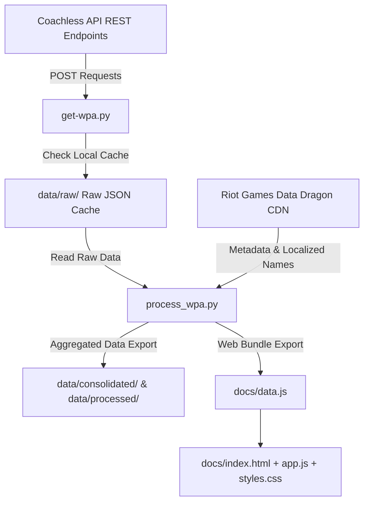

# System Patterns & Architecture

## Pipeline Architecture



---

## 3-Phase Design Pattern

### Phase 1: Data Extraction & Intelligent Caching (`get-wpa.py`)
- Iterates over configured champions (`CHAMPIONS = [236, 901]`) and patch list (`PATCHES = [1..16]`).
- Skips historical patches already present in `data/raw/coachless_champ_{id}_full_stats.json`.
- Forces re-download for the current active/latest patch to maintain up-to-date stats.
- Implements two-tier exception handling (`safe_fetch`) with backoff delays to manage API rate limits and connection drops.

### Phase 2: Transformation & Metadata Mapping (`process_wpa.py`)
- Normalizes data into 8 uniform categories:
  - `keystones` $\to$ Keystone
  - `summoner_spells` $\to$ Spell
  - `boots_or_starters` $\to$ Starter / Boots
  - `item_slot_1` $\to$ 1st Item
  - `item_slot_2` $\to$ 2nd Item
  - `item_slot_3` $\to$ 3rd Item
  - `late_game_items` $\to$ 4th+ Item
- Fetches metadata JSONs from Riot DDragon CDN (`https://ddragon.leagueoflegends.com/cdn/{version}/data/en_US/item.json`, `rune.json`, `summoner.json`).
- Outputs processed CSVs for Excel analysis and updates `docs/data.js` for web frontend deployment.

### Phase 3: Client-Side Dashboard (`docs/`)
- Single-page application using standard ES6 Modules / global window state.
- Real-time client-side calculation of patch range filters:
  ```javascript
  const filteredWeightedWpa = totalSample > 0 ? totalWeightedWpa / totalSample : 0;
  ```
- Interactive header click sorting (by WPA or purchase/pick volume).

---

## Directory Pattern

```
zinkoachless/
├── get-wpa.py                 # Fetcher & Cache Manager
├── process_wpa.py             # Data Aggregator & Web Data Generator
├── memory-bank/               # Core Architectural & Knowledge Base
├── data/
│   ├── raw/                   # Raw JSON data downloaded per patch
│   ├── processed/             # Flattened CSV exports
│   ├── consolidated/          # Aggregated annual WPA JSONs
│   └── granular/              # Granular patch breakdown files
└── docs/                      # Frontend SPA (GitHub Pages Deployment)
    ├── index.html             # UI Structure
    ├── styles.css             # Vanilla CSS Design System
    ├── app.js                 # Frontend Logic & Dynamic Recalculation
    └── data.js                # Embedded JSON Data Bundle for Offline Use
```
