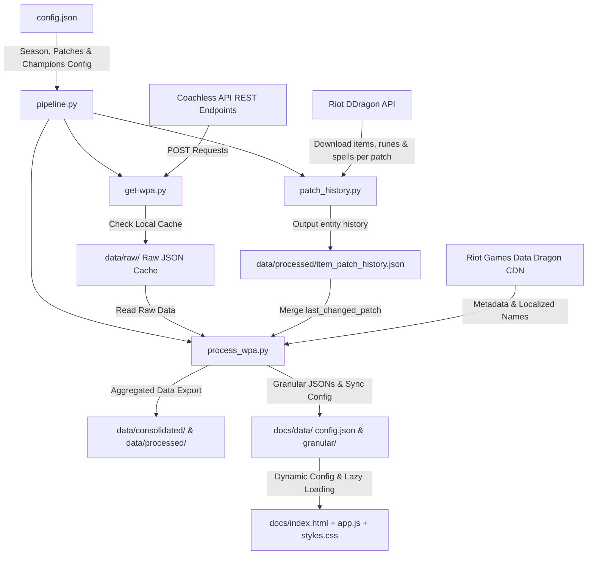

# System Patterns & Architecture

## 4-Phase Architecture


```mermaid
flowchart TD
    CFG[config.json] -->|Season, Patches & Champions Config| PIPE[pipeline.py]
    PIPE --> B[get-wpa.py]
    PIPE --> DDiff[patch_history.py]
    PIPE --> D[process_wpa.py]
    A[Coachless API REST Endpoints] -->|POST Requests| B
    B -->|Check Local Cache| C[data/raw/ Raw JSON Cache]
    DDragon[Riot DDragon API] -->|Download items, runes & spells per patch| DDiff
    DDiff -->|Output entity history| DHist[data/processed/item_patch_history.json]
    C -->|Read Raw Data| D
    DHist -->|Merge last_changed_patch| D
    E[Riot Games Data Dragon CDN] -->|Metadata & Localized Names| D
    D -->|Aggregated Data Export| F[data/consolidated/ & data/processed/]
    D -->|Granular JSONs & Sync Config| G[docs/data/ config.json & granular/]
    G -->|Dynamic Config & Lazy Loading| H[docs/index.html + app.js + styles.css]
```

---

## Design Patterns & Mathematical Frameworks

### 1. Centralized Single Source of Truth (`config.json`)
- Defines active season, patch array, and complete champion catalogue with their supported roles.
- `get-wpa.py`, `patch_history.py`, and `process_wpa.py` read `config.json` directly.
- Sockets seamlessly into `docs/data/config.json` to dynamically generate web UI selectors without hardcoding.

### 2. Unified Master Runner (`pipeline.py`)
- Executes the 3-step pipeline (`patch_history.py` -> `get-wpa.py` -> `process_wpa.py`) sequentially with error traps and runtime reporting.

### 3. Data Extraction & Intelligent Caching (`get-wpa.py`)
- **Rigor Multiparche Completo en Categorías Principales:** La extracción de las 9 categorías esenciales (Keystones, Spells, Starters, Boots, Slot 1, Slot 2, Slot 3, 4th+ Items y All Items) se ejecuta y conserva a lo largo de TODOS los parches configurados (16.1 a 16.x). La ponderación temporal exponencial ($\lambda = 0.75$) prioriza los parches recientes preservando profundidad histórica.
- **Decisión Arquitectónica (ADR) - Deprecación de `GetItemDetailed`:** Se eliminó la llamada a `GetItemDetailed` y las métricas situacionales condicionales (daño mágico/físico, tanques, ventaja de oro, CC). El análisis empírico de los sets generados demostró que estos filtros meramente reordenaban los mismos 5-6 objetos con WPA general positivo ($WPA > 0$), produciendo redundancia estadística. Su eliminación redujo las peticiones por campeón de ~1,360 a 153 (reducción del 90%), eliminando de raíz las saturaciones HTTP 429.
- **Filosofía Off-Meta:** La optimización no asume sesgos semánticos; se reconoce que sinergias contraintuitivas (como un objeto sin MR rindiendo alto contra magos por movilidad o tempo) son el núcleo de Zinkoachless. La eliminación de métricas situacionales responde a economía de red y redundancia matemática, respetando el descubrimiento libre de builds.
- **Manejo Resiliente de Límites de Tasa (HTTP 429):** Concurrencia moderada (2 hilos), espaciado preventivo global (`throttling` de 0.35s con bloqueo de hilo) y auto-cooldown inteligente basado en `retryAt` o espera mínima de 70s.
- **Caché Granular Atómica:** Cada parche completado se escribe inmediatamente en `data/raw/` de forma atómica, protegiendo contra pérdida de progreso ante interrupciones.

### 4. Multi-Entity DDragon Patch Diffing (`patch_history.py`)
- Download & local cache of `item.json`, `runesReforged.json`, and `summoner.json` per patch from DDragon CDN.
- Automated diffing of cost, stats, short/long descriptions, and spell cooldowns across consecutive patches (978 total entities tracked).
- Export to `data/processed/item_patch_history.json`.

### 5. Time-Decay Exponential Weighting ($\lambda = 0.75$)
- Recency-weighted WPA aggregation with half-life $\approx 2.41$ patches:
  $$w_i = \text{sample}(P_i) \times 0.75^{(N - i)}$$
  $$\text{WPA}_{\text{recency}} = \frac{\sum \text{WPA}(P_i) \times w_i}{\sum w_i}$$
- Suppresses multi-month old meta noise while maintaining high statistical confidence for recent play.

### 6. Smart Composite Ranking (`smart_rank`) & Role Badging
- Composite score algorithm: $\text{SmartScore} = \text{WPA}_{\text{recency}} \times (1 + 0.15 \times \log_{10}(\text{Sample}))$.
- Role Badges:
  - `⭐ Meta`: High sample + positive WPA (strictly excludes $WPA < 0$).
  - `🎯 Situacional / Hidden OP`: High-efficiency niche pick / secret OP choice.
  - `📈 Emergente`: Rising WPA momentum ($\Delta \text{WPA} > 0$).
  - `⚡ Ajustado`: Indicates latest patch change.

### 7. Dynamic Market Share Sample Filter
- Mode 1 (`⭐ Populares & Solidez`): Minimum sample threshold $= \max(50, 0.5\% \times \sum_{\text{category}} \text{sample\_size})$.
- Mode 2 (`📚 Catálogo Completo`): Displays 100% of recorded items.

### 8. Lazy Loading Architecture & In-Memory Caching (`docs/app.js`)
- Replaces monolithic data bundles with on-demand fetching of champion JSONs from `docs/data/granular/`.
- Caches loaded champion data in memory (`championDataCache`) and initializes DDragon catalogs once.
- Reduces initial web bundle transfer from 78 MB to under 150 KB.

---

## Directory Pattern

```
zinkoachless/
├── config.json                # Single Source of Truth for Season, Patches, Champions & Roles
├── pipeline.py                # Master Pipeline Runner
├── patch_history.py           # Multi-Entity Patch Change Tracker (DDragon)
├── get-wpa.py                 # Fetcher & Local Raw Cache Manager (Coachless API)
├── process_wpa.py             # Data Aggregator & Direct Compact JSON Exporter
├── memory-bank/               # Core Architectural & Knowledge Base
├── data/                      # Local data directory (ignored by git)
│   ├── raw/                   # Raw JSON data downloaded per patch & DDragon caches
│   └── processed/             # item_patch_history.json (balance diffs)
└── docs/                      # Frontend SPA (GitHub Pages Deployment)
    ├── index.html             # UI Structure & Filter Control Panel
    ├── styles.css             # Glassmorphic Design System & Compact Badges
    ├── app.js                 # Frontend Engine, Recency WPA, Lazy Loader & LoL Item Set Exporter
    └── data/
        ├── config.json        # Synced config for dynamic UI generation
        └── granular/          # Compact granular JSONs per champion/role (<50KB each)
```
